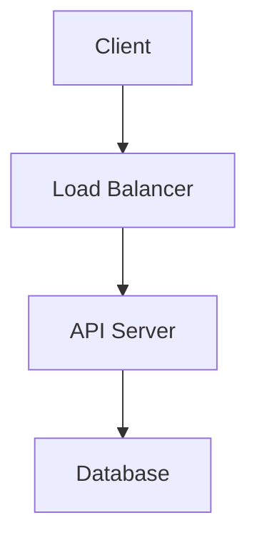

[실제 템플릿 예시](https://github.com/hh-jang-kr/template/wiki)
# [프로젝트명]

## 📋 프로젝트 개요
- **서비스 분야**: [예: 프롭테크, 핀테크, 커뮤니티 등]
- **서비스명**: [서비스 이름]
- **개발 기간**: 20XX.XX.XX ~ 20XX.XX.XX
- **팀 구성**: [개인/팀]

## 🔧 주요 기술 스택
> [!IMPORTANT]  
> **Back-end**: Java 11, Spring Boot, JPA  
> **Database**: MySQL, Redis  
> **Infrastructure**: AWS/NCloud  
> **Tools**: Git, Docker  

## 💡 프로젝트 소개

### 1. 기획 의도 및 배경
- 어떤 문제를 해결하고자 했는지
- 왜 이 프로젝트를 시작하게 되었는지
- 시장/사용자의 니즈

### 2. 핵심 가치
- 프로젝트가 제공하는 핵심 가치
- 기존 솔루션과의 차별점
- 구현하고자 한 특징적인 기능

### 3. 목표 사용자
- 타겟 사용자 정의
- 사용자 페르소나
- 시장 분석 데이터 (있을 경우)

## 🛠 주요 기능

### 1. 핵심 비즈니스 기능
- 기능 1
  - 상세 설명
  - 구현 방식
  - 적용 기술
- 기능 2
  - ...

### 2. 기술적 도전 과제
- 대용량 트래픽 처리 방식
- 동시성 제어 전략
- 성능 최적화 방안
- 확장성 고려사항

## 📊 프로젝트 아키텍처

## 🎯 성과 및 결과
- 정량적 지표
- 성능 개선 수치
- 사용자 피드백
- 문제 해결 과정

## 📈 성능 개선 및 최적화
- 초기 성능 측정 결과
- 개선 작업 내용
- 최종 성능 측정 결과

## 🔍 핵심 문제 해결 과정
1. 문제 상황
2. 해결 방안 검토
3. 적용 과정
4. 결과 및 학습

## 📝 프로젝트 회고
- 기술적 성취
- 아쉬운 점
- 향후 개선 계획
- 학습한 점

## 🔗 관련 자료
- [기술 블로그 포스팅](#)
- [API 문서](#)
- [프로젝트 위키](#)
- [데모 영상](#)
